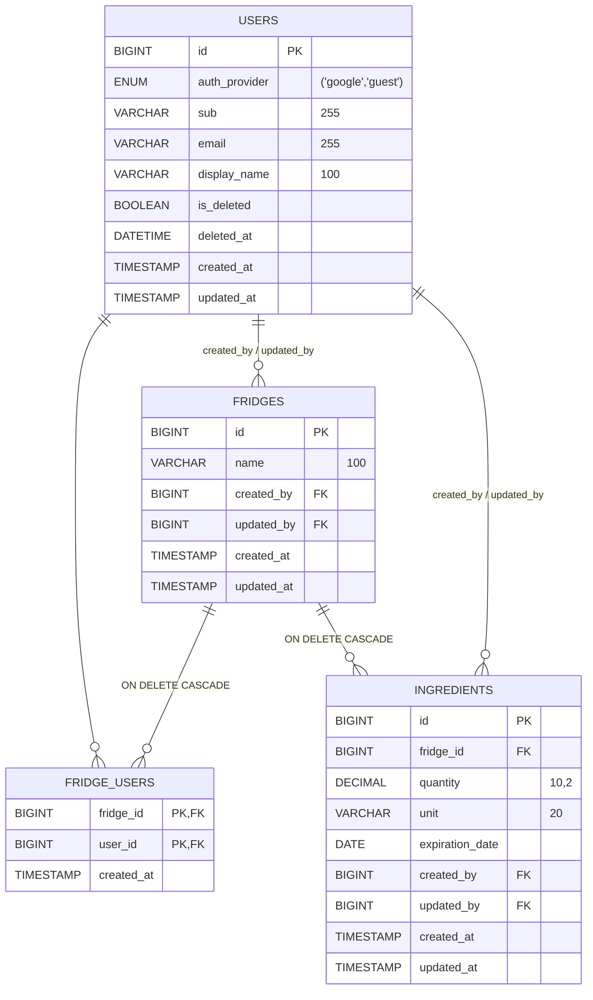

```mermaid
erDiagram
    USERS ||--o{ FRIDGES : "created_by / updated_by"
    USERS ||--o{ FRIDGE_USERS : ""
    FRIDGES ||--o{ FRIDGE_USERS : "ON DELETE CASCADE"
    FRIDGES ||--o{ INGREDIENTS : "ON DELETE CASCADE"
    USERS ||--o{ INGREDIENTS : "created_by / updated_by"

    USERS {
      BIGINT id PK
      ENUM auth_provider "('google','guest')"
      VARCHAR sub "255"
      VARCHAR email "255"
      VARCHAR display_name "100"
      BOOLEAN is_deleted
      DATETIME deleted_at
      TIMESTAMP created_at
      TIMESTAMP updated_at
    }

    FRIDGES {
      BIGINT id PK
      VARCHAR name "100"
      BIGINT created_by FK
      BIGINT updated_by FK
      TIMESTAMP created_at
      TIMESTAMP updated_at
    }

    FRIDGE_USERS {
      BIGINT fridge_id PK, FK
      BIGINT user_id   PK, FK
      TIMESTAMP created_at
    }

    INGREDIENTS {
      BIGINT id PK
      BIGINT fridge_id FK
      DECIMAL quantity "10,2"
      VARCHAR unit "20"
      DATE expiration_date
      BIGINT created_by FK
      BIGINT updated_by FK
      TIMESTAMP created_at
      TIMESTAMP updated_at
    }
```
